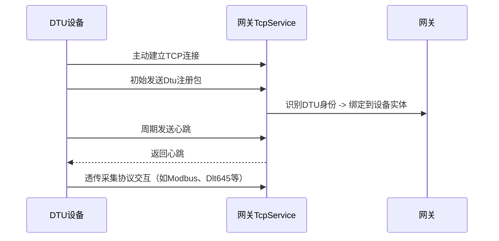

import useBaseUrl from "@docusaurus/useBaseUrl";
import Tag from "@site/src/components/Tag.js";
import Highlight from '@site/src/components/Highlight.js';

# DTU 使用说明（适用于 ThingsGateway）

## 一、什么是 DTU

**DTU（数据透传单元）** 是一种通过 **蜂窝网络（如 4G）** 进行远程数据通信的设备，常用于远程设备的数据采集和上传。

在 ThingsGateway 中，DTU 通常以客户端身份连接至 ThingsGateway ，并通过协议完成注册、心跳维持、数据交互等任务。

---

## 二、DTU 适用场景

- 边缘设备部署在远程或无公网环境下
- 网关部署在中心机房，作为 TCP 服务端
- DTU 主动发起连接，完成注册与数据透传
- 支持多个 DTU 同时连接并采集不同数据

---

## 三、网关配置指南

### 3.1 通道配置

| 配置项                     | 说明 |
|--------------------------|------|
| 插件名称                 | 选择支持 DTU 的协议插件（如 Modbus） |
| 通道类型                 | 选择 `TcpService`（网关作为服务端） |
| 本地地址                 | 例如：`0.0.0.0:9001`，网关监听端口 |
| 启用调试日志             | 建议开启，用于排查 DTU 连接问题 |
| 最大连接数               | 设置可连接的 DTU 数量上限 |
| 客户端连接滑动过期时间   | DTU 无心跳后多久算离线 |
| 心跳内容                 | 设置与 DTU 协商的心跳包内容 |

---

### 3.2 设备配置

在 DTU 模式下，一个 DTU 对应 ThingsGateway 中的一个 **设备实体**。设备配置中需注意：

- **通道**：绑定上一步创建的 TcpService 通道
- **默认执行间隔**：设置数据采集频率
- **DtuId**: 设置与 DTU 协商的注册标识，接收到客户端首次连接包时，提取的注册标识
---

## 四、DTU 设备通信流程

## 五、常见问题

### 1. DTU 连接不上怎么办？

检查公网 IP/端口是否正确配置并开放

确认 DTU 配置了正确的目标地址

打开网关调试日志，查看是否有连接日志

确保网关使用 TcpService 模式

### 2. 多个 DTU 使用同一个端口连接可以吗？

可以。网关会根据注册包 区分不同 DTU 设备，并绑定为不同的采集设备。

### 3. 怎么识别 DTU 的注册标识？

DTU设置注册包，需采集设备的插件属性中的DtuId相同即可。

## 六、最佳实践

如果使用带心跳功能的 DTU，请设置网关心跳内容，避免误判离线
